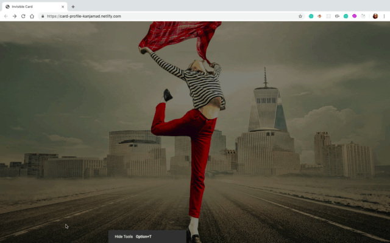

# Invisible-Card
In this project I will build nice profile card. Manipulate on backgrounds and create some cool effects. Project will be built based on HTML and CSS.
* Hover the girl image for 3s, 
* So when the 1st transition of box shadow end. 
* Then after 0.5s the card will move down. 
* Card will display nicely. 

* [Link to project hosted on Netlify](https://card-profile-kanjamad.netlify.com/)

### Viewport Units
* Viewport Height (vh) = mean how many percent of viewport you want hight to be.
* Viewport Width (vw)  = the browser window size. If the viewport is 50cm wide, 1vw = 0.5cm.

### CSS Gradients
CSS gradients let you display smooth transitions between two or more specified colors.

CSS defines two types of gradients:

* Linear Gradients (goes down/up/left/right/diagonally)
* Radial Gradients (defined by their center)

### CSS position Property
The position property specifies the type of positioning method used for an element (static, relative, absolute, fixed or sticky)

### CSS box-shadow Property
The box-shadow CSS propertry adds shadow effects around an element's frame. You can set muliple dffects separated by commas. A box shadow is described by X and Y offsets relative to the element, blur and spread radii, and color.

### CSS object-fit Property
When the image it doesn't have a shape or square then I just need to use object-fit with value cover.

### Additional Resources
1. <a href="https://css-tricks.com/fun-viewport-units/" target="_blank">Fun with viewport units css-tricks</a>
2. <a href="https://www.w3schools.com/css/css3_gradients.asp" target="_blank">CSS Gradients</a>
3. <a href="https://www.w3schools.com/cssref/pr_class_position.asp" target="_blank">CSS position property</a>
4. <a href="https://developer.mozilla.org/en-US/docs/Web/CSS/box-shadow" target="_blank">CSS box-shadow</a>
5. <a href="https://css-tricks.com/snippets/css/a-guide-to-flexbox/" target="_blank">A Complete Guide to Flexbox</a>
6. <a href="https://css-tricks.com/almanac/properties/o/object-fit/" target="_blank">Object-fit</a>
7. <a href="https://css-tricks.com/almanac/properties/t/transform/" target="_blank">CSS transform property</a>